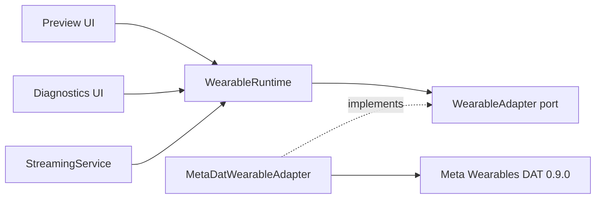
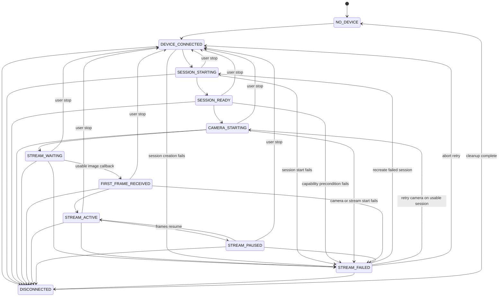
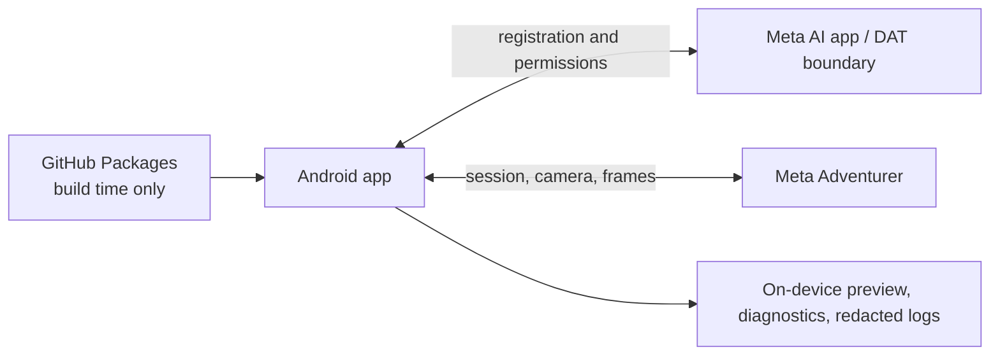

# Architecture Spine — maria Meta Adventurer Camera Milestone

> **Current identity and historical provenance (2026-08-30):** `macgyver` is the current implementation identity. The `maria`, VisionClaw, imported-SHA, and baseline references in this architecture record historical source and baseline provenance. `upstream` remains the VisionClaw provenance remote; the configured `origin` is the current macgyver repository configuration, pending remote verification. This note changes no architecture invariant, lifecycle rule, or physical-acceptance gate.

## Design Paradigm

Use Ports and Adapters around a single unidirectional event reducer. `WearableAdapter` is the provider-neutral port; the Meta adapter is the only DAT-aware implementation and exclusively owns DAT handles; one process-scoped runtime coordinates the port, reduces events into immutable state, and exposes state, transitions, frames, and commands to Compose.



## Invariants & Rules

### AD-1 — DAT remains behind the wearable port [ADOPTED]

- **Binds:** CAP-2, CAP-3, CAP-4, CAP-5; all wearable-facing code
- **Prevents:** DAT types, device assumptions, and lifecycle calls spreading into UI, diagnostics, realtime, operator, or tool layers.
- **Rule:** Only the Meta adapter package may import `com.meta.wearable.dat.*`. `WearableAdapter`, its commands, snapshots, transition events, frame envelopes, telemetry, and errors contain no DAT types. Future `RealtimeProvider`, `Operator`, and `Tools` code may consume provider-neutral outputs but neither the adapter nor runtime may depend on those layers.

### AD-2 — One process-scoped owner controls the hardware lifecycle [ADOPTED]

- **Binds:** CAP-3, CAP-4, CAP-6, CAP-7
- **Prevents:** Activities, ViewModels, services, and reconnect jobs creating or tearing down competing DAT sessions.
- **Rule:** A process-scoped `WearableRuntime`, supplied by a small application container, is the sole coordinator of user intent, the reducer, recovery, and session telemetry. `MetaDatWearableAdapter` exclusively owns the selected DAT device identity, `DeviceSession`, `Camera`, `Stream`, and SDK collectors, and reports provider-neutral events to the runtime. Compose ViewModels issue commands and observe outputs; `StreamingService` supplies foreground liveness only and owns no DAT handle. Migration moves lifecycle calls out of the existing `StreamViewModel` without moving unrelated preview or integration behavior into the adapter.

### AD-3 — One reducer owns all observable state [ADOPTED]

- **Binds:** CAP-3, CAP-4, CAP-5, CAP-6, CAP-7
- **Prevents:** Independent SDK flows, callbacks, and UI actions producing contradictory current state.
- **Rule:** Commands and SDK callbacks become immutable events consumed by one serialized coroutine reducer. Every command, adapter event, transition, and frame carries the active monotonic generation ID; the reducer discards events from retired generations. Only the reducer mutates the canonical `WearableSnapshot`; it publishes the snapshot through `StateFlow`, every accepted state change through a live transition flow, and the latest 256 transitions through a reducer-owned bounded history. Collectors never mutate state directly. The reducer and its tests accept only the edges in the canonical transition graph below.

### AD-4 — A usable first frame is the readiness boundary [ADOPTED]

- **Binds:** CAP-4, CAP-6, CAP-8
- **Prevents:** `STARTED` or `STREAMING` being reported as a usable vision pipeline before image data exists.
- **Rule:** SDK session, camera, and stream startup map to `STREAM_WAITING` until the adapter receives a callback carrying usable image data; DAT codec-configuration-only packets do not qualify. The reducer then emits `FIRST_FRAME_RECEIVED`, sets the sticky first-frame fields, and emits `STREAM_ACTIVE`. Both transitions must remain observable even if the current-state flow advances immediately to `STREAM_ACTIVE`.

### AD-5 — Frames cross the port as app-owned I420 with bounded backpressure [ADOPTED]

- **Binds:** CAP-4, CAP-6; preview and future frame consumers
- **Prevents:** Use-after-callback of DAT buffers, frame-rate UI recomposition, unbounded memory growth, and slow consumers blocking the SDK collector.
- **Rule:** Request DAT `VideoQuality.MEDIUM` at 24 FPS with compression disabled, preserving the VisionClaw raw preview seam. Before returning from collection, copy the contiguous I420 buffer into an app-owned frame envelope containing session ID, generation ID, sequence, monotonic timestamp, width, height, rotation, `I420` format, and bytes ordered Y then U then V. Publish frames on a latest-only bounded channel and count every usable received frame before conflation. A UI-side preview renderer owns I420-to-display conversion off the main thread. No frame is forwarded to an AI layer in this milestone.

### AD-6 — DAT 0.9 lifecycle is explicit and teardown is idempotent [ADOPTED]

- **Binds:** CAP-2, CAP-4, CAP-7
- **Prevents:** Mixing the VisionClaw DAT 0.4 `startStreamSession` model with DAT 0.9, attaching duplicate camera capabilities, or leaking stopped sessions.
- **Rule:** The Meta adapter follows `Wearables.createSession` → start `DeviceSession` → `DeviceSession.addCamera` → `Camera.stream.start`. It observes device-session, camera, stream, and typed error flows separately. Teardown is serialized, safe to repeat, and must establish these ordered postconditions: stream/camera terminated, camera capability detached from the session, collectors cancelled once, then session stopped and discarded. `docs/dat-migration.md` records the exact DAT 0.9 calls verified by the compatibility compile; a terminally stopped session is never reused.

### AD-7 — Recovery follows desired intent and observed state [ADOPTED]

- **Binds:** CAP-4, CAP-7, CAP-8
- **Prevents:** Duplicate retry loops, resurrection after user stop, or retries driven only by guessed error strings.
- **Rule:** The runtime retains a `desiredStreaming` intent distinct from observed state. An explicit user stop clears it. App background/foreground and phone lock/unlock preserve it; the foreground service keeps the process live and recreated Activities only reattach to runtime flows. Process death resets intent and never restarts the camera automatically. An unexpected disconnect retires the active generation, emits `DISCONNECTED`, performs complete teardown, and leaves exactly one cancellable recovery controller waiting for an eligible connected device. Recovery creates a new generation only while `desiredStreaming` remains true: session creation/start failures retry from `SESSION_STARTING`; camera/stream failures retry from `CAMERA_STARTING` only while the current session remains usable. Retry timing is bounded and hardware-tuned, never a busy loop.

### AD-8 — Diagnostics and telemetry are projections of canonical runtime truth [ADOPTED]

- **Binds:** CAP-3, CAP-5, CAP-6, CAP-8
- **Prevents:** Preview, diagnostics, logs, and acceptance evidence disagreeing about device, readiness, errors, or counters.
- **Rule:** Diagnostics render only `WearableSnapshot`, transition events, and session telemetry from the runtime. Latencies use a monotonic clock; wall time is presentation-only. Per session: startup latency is request-to-SDK-streaming, first-frame latency is request-to-first-usable-frame, reconnect latency is disconnect-to-first-usable-recovered-frame, incoming FPS is usable frames over a rolling five-second window updated at most once per second, and received/forwarded counters are monotonic. Forwarded frames remain zero until a future consumer is explicitly connected.

### AD-9 — Failures stay typed, layered, and privacy-safe [ADOPTED]

- **Binds:** CAP-3, CAP-4, CAP-5, CAP-7
- **Prevents:** Generic AI failures hiding hardware faults and diagnostics leaking credentials or private audio.
- **Rule:** Map failures to `DEVICE`, `DAT`, `CAMERA`, `NETWORK`, or `AUTH`, retain the typed DAT cause for diagnosis, and expose one current error plus the bounded transition history. Logs use structured session records and redact API/OAuth secrets, access tokens, DAT credentials, and raw private audio. Production behavior never depends on parsing human-readable DAT error strings. Set `com.meta.wearable.mwdat.ANALYTICS_OPT_OUT=true` and `com.meta.wearable.mwdat.CRASH_REPORTING_OPT_OUT=true` by default; any opt-in requires a later explicit privacy decision.

### AD-10 — Verification and migration evidence are layered [ADOPTED]

- **Binds:** CAP-1, CAP-2, CAP-7, CAP-8
- **Prevents:** Mocks or compilation being mistaken for hardware support and baseline failures being conflated with migration failures.
- **Rule:** Record and build unchanged VisionClaw first. Before lifecycle edits, read the complete DAT changelog from baseline 0.4.0 through target 0.9.0 and map every breaking or behaviorally relevant change to an explicit decision in `docs/dat-migration.md`. Resolve DAT 0.9.0 on the unchanged baseline toolchain and run a minimal compatibility `assembleDebug` before treating the combined stack as pinned; upgrade no other build component unless that gate fails and the change is separately documented. Pure reducer/telemetry tests verify state and metrics, DAT 0.9 MockDeviceKit instrumentation verifies API integration, and the physical Adventurer matrix is the only hardware acceptance authority. The `adventurer-camera-working` tag remains forbidden until every physical gate passes.

### AD-11 — Compatible VisionClaw behavior is preserved [ADOPTED]

- **Binds:** CAP-1, CAP-2; all brownfield edits
- **Prevents:** The camera milestone becoming an unrelated rewrite or silently regressing working VisionClaw paths.
- **Rule:** Before editing, inspect the current Android camera lifecycle plus phone-camera fallback, frame throttling, audio, Gemini Live, OpenClaw, reconnect, WebRTC, settings, and session-state integration surfaces. Preserve each compatible implementation and its behavior. The migration may extract DAT-bound lifecycle coordination from `StreamViewModel` into the provider-neutral runtime and Meta adapter, and may add diagnostics seams; preview and unrelated integration behavior remain unchanged unless a documented DAT migration incompatibility forces a focused adaptation.

### AD-12 — Delivery and local builds obey the milestone safety envelope [ADOPTED]

- **Binds:** CAP-1, CAP-2, CAP-8; all build and delivery units
- **Prevents:** Untraceable baselines, experimental work on known-good branches, false hardware claims, and host out-of-memory failure.
- **Rule:** Preserve upstream traceability and use `main` → `baseline` → `feat/dat-0.9` → `feat/adventurer`; do not experiment on a known-good branch. Use commit intent `chore: establish working Android baseline` and create `baseline-visionclaw` only after the baseline succeeds; use final commit intent `feat: support Meta Adventurer with DAT 0.9`. Keep `hindsight.service` running. Run authorized memory-intensive Gradle commands only through `/home/hermes/.local/bin/codex-memory-run`, one heavy command and one worker at a time, and never fall back to an unscoped heavy command.

## Canonical State Mapping

| Domain transition/state | Accepted evidence |
| --- | --- |
| `NO_DEVICE` | No eligible active device after cleanup |
| `DEVICE_CONNECTED` | One supported connected device is selected and its identity is recorded |
| `SESSION_STARTING` | Session creation/start accepted |
| `SESSION_READY` | DAT device session reaches `STARTED` |
| `CAMERA_STARTING` | Camera attachment/start is in progress |
| `STREAM_WAITING` | Stream startup accepted or SDK streaming observed, but no usable frame has arrived |
| `FIRST_FRAME_RECEIVED` | First callback carrying usable image data was copied into app ownership |
| `STREAM_ACTIVE` | Frames continue arriving after first-frame readiness |
| `STREAM_PAUSED` | DAT session/stream or Android lifecycle reports a recoverable pause |
| `STREAM_FAILED` | Start or runtime failure is classified and cleanup/recovery policy applies |
| `DISCONNECTED` | A previously active device disconnects before cleanup converges to `NO_DEVICE` |

`DeviceType.META_GLASSES` is an explicit supported branch. Selection must never require `RAYBAN_META`; the chosen device identifier is fixed for the lifetime of one session.



`[ADOPTED]` The user-stop and startup-failure edges extend the original source graph so commands and failures have valid reducer outcomes; the canonical `architecture-diagrams.md` companion carries the same edges.

## Diagnostic and Evidence Ownership

| Owner | Required fields |
| --- | --- |
| `WearableSnapshot` | Active device name/type/ID/capabilities; battery and thermal state; DAT registration, device-session, camera, and stream states; first-frame received and last-frame timestamp; Bluetooth input/output routes; realtime provider/connection, Hermes gateway, last tool call, and last error placeholders |
| `WearableTelemetry` | Stream startup, first-frame, and reconnect latencies; rolling incoming FPS; received-frame and forwarded-frame totals |
| Transition history | Latest 256 reducer-accepted transitions: session ID, generation ID, transition and monotonic timestamp, disconnect reason, classified layer, typed error code, and redacted message |
| Structured session record | `session_id`, `device_type`, DAT state, camera state, first-frame latency, frames received, frames forwarded, disconnect reason, and errors by layer |
| Physical acceptance record | Meta Adventurer Standard 49 mm; phone model, Android version, Meta Wearables setup version, DAT registration and selected DAT version, app commit, build variant, network conditions; per case: transitions, first-frame result, latency, recovery result, and layer-specific error |

## Consistency Conventions

| Concern | Convention |
| --- | --- |
| Domain names | Public hardware states use the uppercase names in the canonical SPEC; Kotlin types use PascalCase and values use lower camel case. |
| Identity | Generate one opaque `session_id` per session attempt and attach it to every transition, frame envelope, metric, and structured log record. |
| Time | Use Android monotonic elapsed time for ordering, latency, and FPS; convert wall time to ISO 8601 only when presenting or exporting evidence. |
| Mutation | Commands and callbacks enqueue reducer events; public snapshots and events are immutable. |
| Errors | `WearableFailure(layer, code, recoverability, redactedMessage, causeType)`; never branch on localized description text. |
| Concurrency | One reducer consumer and one frame collector per active stream; lifecycle commands are idempotent. |
| Configuration | DAT package credentials live in environment or ignored `local.properties`; no secret enters source, logs, diagnostics, or test fixtures. |
| Placeholder fields | Realtime, Hermes, tool-call, and unwired audio fields render `NOT_CONFIGURED` or `NOT_AVAILABLE`. |

## Stack

| Name | Version |
| --- | --- |
| VisionClaw Android baseline seed | upstream `fbc72a2` |
| Meta Wearables DAT core/camera/mockdevice | `0.9.0` target candidate; `0.4.0` baseline; combined pin follows compatibility assemble |
| Android Gradle Plugin | `8.6.0` baseline |
| Gradle wrapper | `8.14.1` baseline |
| Kotlin / Compose compiler plugin | `2.1.20` baseline |
| Jetpack Compose BOM | `2024.04.01` baseline |
| Android SDK | compile 35; target 34; min 31 |

## Structural Seed

```text
samples/CameraAccessAndroid/app/src/main/java/.../cameraaccess/
  wearables/
    WearableAdapter.kt              # provider-neutral commands and flows
    WearableRuntime.kt              # provider-neutral lifecycle coordinator and recovery controller
    WearableModels.kt               # snapshot, transitions, frames, failures
    WearableTelemetry.kt            # monotonic session metrics
    FramePreviewRenderer.kt         # I420 conversion outside the adapter/main thread
    meta/
      MetaDatWearableAdapter.kt      # only DAT-aware implementation
      MetaDatStateMapper.kt          # DAT events to domain events/failures
  diagnostics/
    DiagnosticsViewModel.kt         # read-only projection of WearableRuntime
    DiagnosticsScreen.kt            # required developer surface
  stream/
    StreamingService.kt             # foreground liveness shell; no DAT ownership
  ui/
    ...                             # preview and existing Compose surfaces
```



There is no milestone backend, cloud video path, realtime provider, gateway, operator, or tool deployment.

## Capability → Architecture Map

| Capability / Area | Lives in | Governed by |
| --- | --- | --- |
| CAP-1 baseline | Build files, `docs/baseline.md` | AD-10, AD-11, AD-12, Stack |
| CAP-2 DAT migration | `wearables/meta`, `docs/dat-migration.md` | AD-1, AD-6, AD-10, AD-11, AD-12 |
| CAP-3 Adventurer identity | Meta adapter discovery and state mapper | AD-1, AD-2, canonical mapping |
| CAP-4 lifecycle/readiness | Runtime reducer and Meta adapter | AD-2, AD-3, AD-4, AD-6, AD-7 |
| CAP-5 diagnostics | `diagnostics` projection | AD-8, AD-9, conventions |
| CAP-6 preview/metrics | Frame port, telemetry, Compose preview | AD-4, AD-5, AD-8 |
| CAP-7 recovery | Runtime recovery controller | AD-2, AD-6, AD-7, AD-10 |
| CAP-8 physical proof | Acceptance harness and evidence record | AD-8, AD-10, AD-12, evidence ownership |

## Deferred

- Ratify the structural seed and upstream baseline seed against the exact VisionClaw commit imported into `maria`; if the imported commit differs from `fbc72a2`, update this spine before epics are marked implementation-ready.
- Tune recovery delays and retry limits from physical Adventurer evidence; preserve one-controller and no-busy-loop invariants.
- Choose future AI frame encoding, throttling, and forwarding behind a separate `RealtimeProvider`; revisit only when that capability enters scope.
- Multi-device selection and live device switching; revisit after the single-Adventurer milestone.
- Realtime providers, Gemini/OpenAI regression work, Operator/Hermes, Tools, production Bluetooth audio, WebRTC changes, backend infrastructure, and store/release architecture remain outside this spine.
- Broad AGP, Kotlin, Compose, SDK, or dependency modernization; revisit only after the reproducible DAT 0.4 baseline is recorded or a DAT 0.9 compatibility failure requires a focused change.
- GitHub fork owner and remote destination; resolve before publishing or pushing the fork.
- Physical-test phone model, Android version, Meta Wearables setup, and DAT registration; resolve before the acceptance run.
