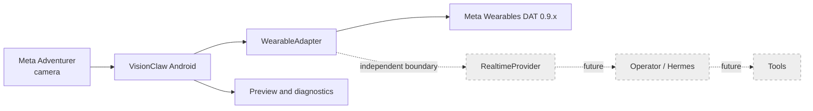
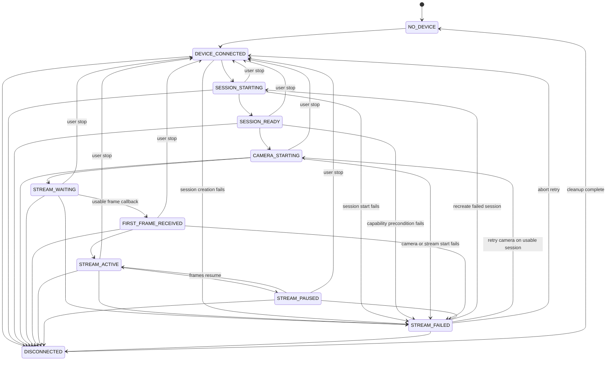

# Architecture Diagrams

## Milestone boundary

Only the solid-path hardware adapter, preview, and diagnostics are implemented in this milestone. Dashed nodes define architectural boundaries, not current scope.

## Readiness and recovery

